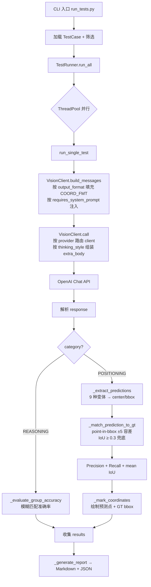

# GUI VLM 测试平台 · 系统架构概览

> **创建**: 2026-04-20 21:00  
> **对应版本**: v3.2

---

## 1. 设计目标

在**单一代码库**中统一评测"视觉大模型 × GUI 定位/推理任务"，需满足：

1. **多 Provider 抽象** — ARK（火山方舟）+ DashScope（阿里云百炼），未来可扩展到 Anthropic / OpenAI 等
2. **模型可配置化** — 新加一个模型 = `MODELS` 注册表新增一行，不改逻辑
3. **Prompt-格式解耦** — 同一任务描述对 9 个模型自动切换其官方推荐坐标格式
4. **评估可量化** — 定位任务用 Precision/Recall 双指标 + IoU 兜底；推理任务用模糊匹配准确率
5. **实验可追溯** — 每次运行生成独立 JSON + Markdown + 标记图，历史结果全部保留

---

## 2. 分层架构（DDD 风格）

```
┌──────────────────────────────────────────────────────────────────┐
│  Presentation / CLI          run_tests.py  (argparse)            │
├──────────────────────────────────────────────────────────────────┤
│  Application / Orchestration                                     │
│    TestRunner                                                    │
│      ├─ run_all()          并行调度 + 超时控制                    │
│      ├─ run_single_test()  单次测试全流程                         │
│      ├─ _evaluate()        路由到定位评估 / 推理评估              │
│      └─ _generate_report() Markdown + JSON 输出                  │
├──────────────────────────────────────────────────────────────────┤
│  Domain / 核心业务                                                │
│    ├─ TestCase         (test_cases.py)   任务定义 + prompt 模板  │
│    ├─ ModelConfig      (config.py)       模型元信息注册表        │
│    ├─ GTItem           (ground_truth.py) 标注坐标 (0-1000)      │
│    └─ Evaluation       (test_runner._evaluate_*)  Precision/Recall/IoU │
├──────────────────────────────────────────────────────────────────┤
│  Infrastructure / 适配层                                          │
│    ├─ VisionClient       (client.py)       OpenAI SDK 封装       │
│    │    └─ per-provider 懒加载 & 缓存                             │
│    ├─ Prompt Builder     (coord_formats.py) {COORD_FMT} 模板     │
│    ├─ GUI-Plus Adapter   (gui_plus_prompts.py)  computer_use     │
│    └─ Prediction Parser  (test_runner._extract_predictions)     │
│         9 种输出变体统一到 {center, bbox}                         │
└──────────────────────────────────────────────────────────────────┘
```

---

## 3. 核心数据流



---

## 4. 核心抽象

### 4.1 `ModelConfig`（`@src/config.py:58-81`）

```python
@dataclass(frozen=True)
class ModelConfig:
    name: str                   # 模型 ID
    supports_thinking: bool     # 是否支持 thinking 切换
    display_name: str = ""
    provider: str = "ark"       # ark | dashscope
    requires_system_prompt: bool = False  # 如 gui-plus
    output_format: str = "point"          # point | bbox | qwen_point | tool_call
    vl_high_resolution: bool = False      # DashScope 视觉高清标志
```

**添加新模型 = 一行代码**（新 provider 需先在 `PROVIDER_CONFIG` 注册）

### 4.2 `TestCase`（`@src/test_cases.py:28-43`）

```python
@dataclass
class TestCase:
    id: str
    name: str
    category: TestCategory       # POSITIONING | REASONING
    prompt: str                  # 可包含 {COORD_FMT} 占位符
    image_path: Path
    enable_thinking: bool = False
    expected_groups: list[str] = field(default_factory=list)
    has_ground_truth: bool = False    # 是否启用 GT 坐标评估
    multi_target: bool = False        # 多目标 → 使用 MULTI_TARGET_INSTRUCTIONS
```

### 4.3 Provider 差异（`@src/config.py:40-51`）

| Provider | base_url | thinking 参数 |
|---|---|---|
| `ark` | `https://ark.cn-beijing.volces.com/api/v3` | `extra_body={"thinking":{"type":"enabled","budget_tokens":N}}` |
| `dashscope` | `https://dashscope.aliyuncs.com/compatible-mode/v1` | `extra_body={"enable_thinking": True/False, "vl_high_resolution_images": True}` |

两个 Provider 都走 OpenAI 兼容协议 → **同一套 SDK（`openai` Python）统一调用**，仅差异在 `base_url` / `api_key` / `extra_body` 字段风格。

---

## 5. 关键设计决策

### 5.1 方案 A：按官方推荐格式分化 prompt
> **问题**：原始版本对所有模型用统一 `<point>x y</point>`，导致 1-5-pro / gui-plus 性能受损。
>
> **决策**：引入 `output_format` 字段 + `{COORD_FMT}` 占位符模板替换。
>
> **效果**：1-5-pro POS_001a 命中率从 0% → 100%，gui-plus 在 POS_001 达到 100/100。

### 5.2 Precision + Recall 双指标
> **问题**：单指标会误导 —— gui-plus 只输出 1 个点正确就 100% 了。
>
> **决策**：X% = 命中数/预测数（精度），Y% = 覆盖 GT 数/GT 总数（召回）。
>
> **效果**：能清晰区分 "滥报" vs "漏报" vs "精准"。

### 5.3 解析器 9 变体兼容（无前置假设）
> **问题**：不同模型自回归输出的坐标包裹形式五花八门，强制一致会拒绝部分正确答案。
>
> **决策**：`_extract_predictions()` 支持 A/B/C/D/D'/E/F/G/H 共 9 种包裹 + 裸坐标兜底（`@src/test_runner.py:503-600`）。
>
> **效果**：v3.1 引入 H 兜底后 qwen3.6-flash thinking 模式从 0/0 → 67/67（POS_003 最佳）。

### 5.4 单任务超时 + 并行
> **问题**：seed-1-6 thinking 可达 100s+，串行执行 74 次需 45 分钟。
>
> **决策**：`ThreadPoolExecutor(max_workers=4)` + `openai` timeout 参数。
>
> **效果**：9 模型全矩阵从 45min → 11 分钟。

### 5.5 坐标空间统一 0-1000
> **问题**：各家归一化空间不同（1000×1000 / pixel / 0-1）。
>
> **决策**：prompt 强制要求 0-1000，GT bbox 也用 0-1000，评估时无需缩放。
>
> **效果**：跨分辨率图片、跨模型评估口径一致。

---

## 6. 扩展点

### 6.1 新增模型
`@src/config.py` MODELS 字典追加：

```python
"new-model-id": ModelConfig(
    name="new-model-id",
    supports_thinking=True,
    display_name="new-model",
    provider="dashscope",
    output_format="qwen_point",
    vl_high_resolution=True,
),
```

### 6.2 新增 Provider
`@src/config.py` 在 `PROVIDER_CONFIG` 加入 base_url / thinking_style / api_key_env，
然后在 `@src/client.py` 的 `call()` 中 `thinking_style == "new_provider"` 分支里组装 extra_body。

### 6.3 新增输出格式
1. `@src/coord_formats.py` SINGLE/MULTI_TARGET_INSTRUCTIONS 加模板
2. `@src/test_runner.py::_extract_predictions` 加解析分支

### 6.4 新增测试用例
`@src/test_cases.py` 新建 `TestCase(...)`；
如需坐标评估，在 `@src/ground_truth.py` 的 `GROUND_TRUTH` 字典加同 ID 的标注。

---

## 7. 当前未采用但值得考虑的改进

| 改进 | 动机 | 优先级 |
|---|---|---|
| 引入 `seed` 参数 | 实验精确可复现 | 高 |
| 差异化 `thinking_budget` | 单目标浪费 token，多目标不够 | 中 |
| `max_tokens` 显式设置 | 防止长列表截断 | 中 |
| 重试 + 指数退避 | 应对 429/502 偶发 | 中 |
| Streaming 响应 | 长思考可见进度 | 低 |
| 评估结果 Web Dashboard | 替代 Markdown 报告 | 低 |

---

## 8. 参考资料

- 火山方舟视觉理解：https://www.volcengine.com/docs/82379/1616136
- 阿里云百炼 Qwen-VL Cookbook：https://developer.aliyun.com/article/1685124
- GUI-Plus 模型详情：https://bailian.console.aliyun.com/cn-beijing/?tab=model
