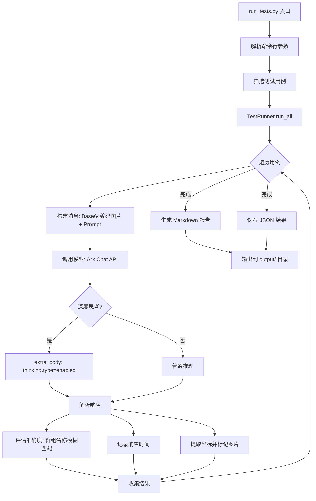

# doubao-seed-1-6-vision-250815 GUI模型性能测试

## 概述

本项目用于测试 `doubao-seed-1-6-vision-250815` GUI模型的性能，重点评估：
- **准确度**：模型识别和定位UI元素的准确程度
- **响应时间**：模型推理的耗时
- **深度思考对比**：开启/关闭深度思考对模型表现的影响

## 项目结构

```
ARKAPITEST/
├── pyproject.toml          # 项目配置（uv + python 3.12）
├── run_tests.py            # 测试入口脚本
├── src/
│   ├── __init__.py
│   ├── config.py           # 配置常量（API参数、路径、Ground Truth）
│   ├── client.py           # API客户端（单例模式，封装Ark SDK）
│   ├── test_cases.py       # 测试用例定义（6个预定义 + 1个可选截图用例）
│   └── test_runner.py      # 测试执行引擎（执行、评估、报告生成）
├── resource/
│   └── image.png           # 测试图片（Telegram 搜索结果截图）
├── output/                 # 测试结果输出目录
│   ├── report_YYYYMMDD_HHMMSS.md      # Markdown 报告
│   ├── results_YYYYMMDD_HHMMSS.json   # JSON 结果
│   └── POS_XXX_marked.png             # 坐标标记图片
└── docs/
```

## 测试用例

| ID | 名称 | 类别 | 深度思考 | 说明 |
|----|------|------|----------|------|
| POS_001 | 单个群组图标定位 | 定位能力 | 否 | 定位单个群组的图标坐标 |
| POS_002 | 多个群组图标定位 | 定位能力 | 否 | 批量定位所有群组图标坐标 |
| RSN_001 | 群组信息提取(非深度思考) | 推理分析 | 否 | 识别群组并提取结构化信息 |
| RSN_002 | 群组信息提取(深度思考) | 推理分析 | 是 | 同上，启用深度思考 |
| RSN_003 | 界面布局分析(非深度思考) | 推理分析 | 否 | 分析应用界面布局和内容 |
| RSN_004 | 界面布局分析(深度思考) | 推理分析 | 是 | 同上，启用深度思考 |
| SCR_001 | 全屏截图分析 | 推理分析 | 否 | 可选，截取当前屏幕分析 |

## 测试流程



## 使用方法

```bash
# 前置：设置 API Key
set ARK_API_KEY=your_api_key

# 运行所有测试
uv run python run_tests.py

# 只运行定位测试
uv run python run_tests.py --category positioning

# 只运行推理测试
uv run python run_tests.py --category reasoning

# 指定测试用例
uv run python run_tests.py --ids POS_001 RSN_001

# 包含全屏截图测试
uv run python run_tests.py --screenshot
```

## 深度思考参数

通过 `extra_body` 传入 `thinking` 参数控制深度思考模式：

```python
# 开启深度思考
extra_body = {
    "thinking": {
        "type": "enabled",        # enabled | disabled | auto
        "budget_tokens": 10000,   # 思考 token 预算
    }
}
```

## 评估方法

- **群组识别准确度**：将模型回复中识别到的群组名称与 Ground Truth 进行模糊匹配，计算识别率
- **响应时间**：从调用开始到收到完整响应的端到端时间
- **Token 用量**：记录 prompt_tokens、completion_tokens、total_tokens

## 依赖

- `volcengine-python-sdk>=5.0.0`（包含 `volcenginesdkarkruntime`）
- `Pillow>=10.0.0`
- `httpx>=0.27.0`
- `pydantic>=2.0.0`
