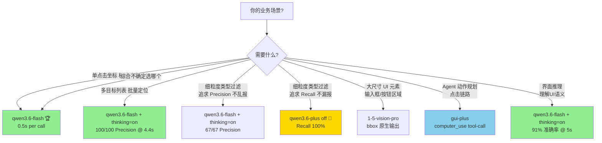

# GUI 视觉大模型 · 选型与接入实用手册

> **目标读者**：其他项目的技术/产品同学，需要在 GUI Agent、UI 自动化、界面分析等场景接入视觉大模型
> **预期阅读时间**：10 分钟
> **数据来源**：本项目 v3.2 矩阵（9 模型 × 9 用例 × thinking off/on，2026-04-20 实测）
> **快速跳转**：[选型决策树](#1-选型决策树) · [最小代码](#2-最小可运行代码) · [Prompt 模板](#3-prompt-模板速查) · [参数最佳实践](#4-参数最佳实践) · [避坑清单](#5-避坑清单必读)

---

## 1. 选型决策树



**一句话总结**：**大多数场景直接选 `qwen3.6-flash`**（速度 + 准确率 + 稳定性三项全优）。只有两个特殊场景选其他：
- 追求 Recall 100%（宁多报不漏）→ `qwen3.6-plus`
- 需要 Agent 点击链路（computer_use 协议）→ `gui-plus`

---

## 2. 最小可运行代码

### 2.1 单次 grounding 调用（推荐：qwen3.6-flash）

```python
# pip install openai pillow
import os
import base64
from openai import OpenAI

def ground_ui_element(image_path: str, instruction: str) -> str:
    """在图片中定位 UI 元素，返回 <point>(x, y)</point> 格式坐标（0-1000 空间）"""
    client = OpenAI(
        api_key=os.getenv("DASHSCOPE_API_KEY"),
        base_url="https://dashscope.aliyuncs.com/compatible-mode/v1",
    )

    # 图片转 base64
    with open(image_path, "rb") as f:
        b64 = base64.b64encode(f.read()).decode()
    ext = image_path.rsplit(".", 1)[-1].lower().replace("jpg", "jpeg")

    prompt = (
        f"{instruction}\n"
        "请以 <point>(x, y)</point> 格式返回该位置的中心坐标，"
        "坐标范围为 0-1000（图像宽高均归一化到此区间）。\n"
        "只需要返回坐标，不需要其他信息。"
    )

    resp = client.chat.completions.create(
        model="qwen3.6-flash",
        messages=[{
            "role": "user",
            "content": [
                {"type": "image_url", "image_url": {"url": f"data:image/{ext};base64,{b64}"}},
                {"type": "text", "text": prompt},
            ],
        }],
        temperature=0.0,
        extra_body={
            "enable_thinking": False,            # 单目标定位无需 thinking
            "vl_high_resolution_images": True,   # 视觉模型必开，精度提升显著
        },
    )
    return resp.choices[0].message.content

# 用例
coord = ground_ui_element("screenshot.png", "请定位右上角的关闭按钮")
print(coord)  # 形如 <point>(985, 20)</point>
```

**坐标还原到像素**：`pixel_x = point_x * image_width / 1000`

### 2.2 多目标批量定位

```python
prompt = (
    "请找出图片中所有群组头像的位置，按从上到下顺序。\n"
    "请以以下格式逐行输出所有目标：\n"
    "1. [元素名称] <point>(x, y)</point>\n"
    "2. [元素名称] <point>(x, y)</point>\n"
    "...\n"
    "坐标范围为 0-1000。"
)
# 多目标建议开 thinking（Precision 更高）
extra_body = {"enable_thinking": True, "vl_high_resolution_images": True}
```

### 2.3 Agent 动作规划（gui-plus）

```python
# gui-plus 需要注入官方 system prompt，输出 computer_use tool-call JSON
# 完整 system prompt 见本项目 src/gui_plus_prompts.py
GUI_PLUS_SYSTEM = """# Tools
...（见项目源码 src/gui_plus_prompts.py）
"""

resp = client.chat.completions.create(
    model="gui-plus-2026-02-26",
    messages=[
        {"role": "system", "content": GUI_PLUS_SYSTEM},
        {"role": "user", "content": [
            {"type": "image_url", "image_url": {"url": f"data:image/png;base64,{b64}"}},
            {"type": "text", "text": "请使用 computer_use 工具的 click 动作，点击登录按钮。"},
        ]},
    ],
    temperature=0.0,
    extra_body={"enable_thinking": False, "vl_high_resolution_images": True},
)
# 输出形如：Action: Click the login button
# <tool_call>{"name":"computer_use","arguments":{"action":"left_click","coordinate":[512,640]}}</tool_call>
```

### 2.4 输出解析（必须做容错）

```python
import re

def extract_points(content: str) -> list[tuple[int, int]]:
    """从模型回复中提取所有 (x, y) 点，兼容多种变体"""
    patterns = [
        r"<points?\b[^>]*x1=\"(\d+)\"[^>]*y1=\"(\d+)\"",     # 属性式（qwen3.6-plus 变体）
        r"<points?>[\s(\[]*(\d+)[,\s]+(\d+)[)\]\s]*</points?>",  # 标准 + 括号
        r"<points?>[\s(\[]*(\d+)[,\s]+(\d+)",                # 无闭合兜底
        r"^\s*[\(\[]?(\d+)[,\s]+(\d+)[\)\]]?\s*$",          # 裸坐标兜底（按整行 strip）
    ]
    for pat in patterns:
        matches = re.findall(pat, content)
        if matches:
            return [(int(x), int(y)) for x, y in matches]
    return []
```

---

## 3. Prompt 模板速查

### 3.1 按模型类型选模板

| 模型系 | output_format | 单目标模板 | 多目标模板 |
|---|---|---|---|
| doubao-seed-1-6 / thinking | `point` | `<point>x y</point>` | `1. [名称] <point>x y</point>` |
| doubao-1-5-vision-pro | `bbox` | `<bbox>x1 y1 x2 y2</bbox>` | `1. [名称] <bbox>x1 y1 x2 y2</bbox>` |
| **所有 qwen-vl 系 / qwen3.6 系** | `qwen_point` | **`<point>(x, y)</point>`** | **`1. [名称] <point>(x, y)</point>`** |
| gui-plus | `tool_call` | `<tool_call>{computer_use click [x,y]}</tool_call>` | 多次 tool_call |

**关键原则**：**一定要按模型官方推荐格式**，用错格式会导致解析失败或准确率大幅下降（实测 1-5-pro 用 point 格式命中率从 100% → 0%）。

### 3.2 任务引导词（与坐标格式说明结合使用）

**单目标定位** — 消除左右上下歧义：
```
请在图片 **[左侧/右侧/顶部]的[具体区域]** 中，找到 [元素描述（含颜色、形状、文字）]。
{坐标格式说明}
```

**多目标定位** — 明确排序 + 输出位置：
```
请在图片 [区域] 中找到所有 [类型] 元素，按 [从上到下 / 从左到右] 顺序列出，
每个元素返回 [名称 + 图标中心坐标]。
{多目标坐标格式说明}
```

**类型过滤定位** — 明确判断依据 + 宁缺毋滥：
```
请找出 [目标类型] 的条目。
类型判断依据：
- 👥 图标 A = [target]（需要返回）
- 📢 图标 B = [ignore]（忽略）
- 🤖 图标 C = [ignore]（忽略）
如果不能 100% 确认某条目符合条件，请不要输出该条目（宁缺毋滥）。
{多目标坐标格式说明}
```

**结构化推理** — 明确字段 + 输出格式：
```
请从图片中识别 [目标]，对每一个提供：
1. 名称
2. @handle（如果可见）
3. 图标描述
4. 中心坐标 (x, y)，范围 0-1000
请以表格格式输出。
```

---

## 4. 参数最佳实践

### 4.1 固定值（生产环境直接照抄）

| 参数 | 值 | 理由 |
|---|---|---|
| `temperature` | **0.0** | Grounding 是确定性回归任务，T>0 会引入坐标抖动；厂商 Cookbook 一致推荐 |
| `top_p` / `top_k` | **不设** | T=0 下贪心解码，采样参数不生效 |
| `vl_high_resolution_images` | **True**（DashScope 视觉模型）| 小 icon 识别精度显著提升 |
| `seed` | **42**（任意固定值）| 提升实验可复现性 |

### 4.2 按场景切换

| 参数 | 单目标 | 多目标 | 推理 |
|---|:---:|:---:|:---:|
| `enable_thinking`（qwen / doubao-1-6）| False | **True** | **True** |
| `thinking_budget`（仅 ARK） | 2000 | 8000 | 10000 |
| `max_tokens` 建议 | 512 | 2048 | 4096 |
| 超时时间（秒） | 30 | 120 | 120（thinking on 可到 300） |

---

## 5. 避坑清单（必读）

### 坑 1：坐标空间不统一

不同厂商默认坐标空间不一样：
- Doubao / Qwen：0-1000 归一化（相对坐标）
- gui-plus 默认：像素坐标（除非 system prompt 声明 1000×1000）

**解决**：prompt 里**强制要求 0-1000**（所有模型都支持），后端统一换算到像素。

### 坑 2：1-5-vision-pro 不要用 point 格式

实测用 `<point>x y</point>` 指令，模型会输出 `<point>10 20 30 40</point>`（把 bbox 塞进 point 壳），解析失败。

**解决**：**必须用 `<bbox>x1 y1 x2 y2</bbox>` 格式**，然后计算中心点。

### 坑 3：Qwen-VL-Plus thinking 模式可能 BalanceError

`qwen3-vl-plus-2025-12-19` 开 thinking 时百炼侧报 `BalanceError: There are no suitable clusters`，疑似模型变体未全部开通。

**解决**：优先使用 **qwen3.6-plus / qwen3.6-flash**（3.6 系列稳定），或降级到 qwen3-vl-plus non-thinking。

### 坑 4：Qwen 系输出变体繁多

实测同一模型可能输出 **9 种不同的坐标包裹**：
- `<point>(100, 200)</point>`（标准）
- `<point>[100, 200]</point>`（中括号）
- `<point x1="100" y1="200" />`（自闭合属性）
- `<points x1="100" y1="200" alt="...">...</points>`（qwen3.6-plus 独有）
- `<point>(100, 200)`（thinking 模式偶发丢 `</point>`）
- `(100, 200)`（thinking 模式偶发裸坐标）

**解决**：解析器必须**容错**，不能硬匹配单一正则。参考本项目 `@src/test_runner.py::_extract_predictions` 的 9 种变体解析。

### 坑 5：thinking=on 延迟巨大

- qwen3.6-plus POS_003 thinking=on：**218 秒 / 11,642 token**
- seed-1-6-vision RSN_001 thinking=on：**101 秒**
- qwen3-vl-32b-thinking：默认 thinking，无法关闭，50-80 秒起

**解决**：
- 单目标任务一律关 thinking（速度快 10-20 倍，准确率几乎无差）
- 多目标/推理才开 thinking
- 设置 `timeout` 兜底（建议 120-300s）

### 坑 6：不同 Provider thinking 参数语法不同

```python
# ARK（火山方舟）：
extra_body = {"thinking": {"type": "enabled", "budget_tokens": 10000}}

# DashScope（百炼）：
extra_body = {"enable_thinking": True}

# 混用会导致参数被忽略！
```

**解决**：按 provider 路由，参考 `@src/client.py::call` 的 `thinking_style` 分支。

### 坑 7：gui-plus 必须注入官方 system prompt

不注入时 `computer_use` 工具不激活，模型会用自然语言回答。

**解决**：直接复用 `@src/gui_plus_prompts.py` 的 `GUI_PLUS_SYSTEM_PROMPT`（阿里官方 Quick Start 版本）。

### 坑 8：并发过高触发 RateLimit

qwen3-vl-plus 并发 4 时偶发 `429 limit_requests`。

**解决**：
- 百炼侧并发建议 ≤ 4
- 加指数退避重试：`retry_on_rate_limit(max_retries=3, base_delay=2)`

---

## 6. 评估方法建议（如果你要做自己的评测）

### 6.1 定位任务 · 双指标

**单指标会误导**（例：gui-plus 只输出 1 个点正确就 100% 了）。建议同时报告：

- **Precision（点命中率）** = 命中 GT 的预测数 / 预测总数
- **Recall（GT 覆盖率）** = 被命中的 GT 数 / GT 总数

命中判定：预测中心点落在 GT bbox 内（**±5 单位容差**，0-1000 空间）。

### 6.2 Ground Truth 标注成本

- 每个测试图人工标 bbox（0-1000 相对坐标），**10 个关键元素约 15 分钟**
- 推荐配套脚本：`@scripts/visualize_gt.py` 可叠加 GT bbox 到原图，便于校准

### 6.3 thinking matrix 对比

对支持 thinking 的模型，**每个用例额外跑一份 thinking=on 版本**，形成 2N 条数据。观察 on/off 的 delta：
- 单目标定位：delta 通常 ≈ 0（甚至 on 略劣，因思考容易自我怀疑）
- 多目标/类型过滤：thinking=on 通常 +10~30% Precision
- 复杂推理：thinking=on 显著提升，但耗时 3-10 倍

---

## 7. 接入 Checklist

准备接入前逐条确认：

- [ ] API Key 已获取（ARK / DashScope 控制台）
- [ ] 业务场景已匹配选型决策树 → 确定主模型 + 备选
- [ ] Prompt 模板按 output_format 对齐
- [ ] `temperature=0.0` + `vl_high_resolution_images=true`
- [ ] thinking 按任务类型切换，设置 timeout
- [ ] 输出解析器做 5+ 种变体容错
- [ ] 坐标统一归一化到 0-1000（或统一到像素）
- [ ] 并发控制 ≤ 4 + 指数退避重试
- [ ] 关键业务路径加监控（延迟 P99、准确率抽检）

---

## 8. 快速参考链接

| 资源 | URL |
|---|---|
| 本项目仓库 | https://github.com/JerryYuan4733/GUIModelTest |
| 完整实验数据（v3.2 矩阵） | `@docs/explain/2026-04-20-1650-GUI-VLM调研与复现实验.md` §7.8 |
| 系统架构设计 | `@docs/architecture/2026-04-20-2100-系统架构概览.md` |
| 火山方舟控制台 | https://console.volcengine.com/ark |
| 阿里云百炼控制台 | https://bailian.console.aliyun.com/ |
| Doubao-Vision 官方文档 | https://www.volcengine.com/docs/82379/1616136 |
| Qwen3-VL Cookbook | https://developer.aliyun.com/article/1685124 |

---

**本手册对应版本**：v3.2（2026-04-20）
**下次更新触发**：新增模型、新增 provider、或发现新的关键结论
