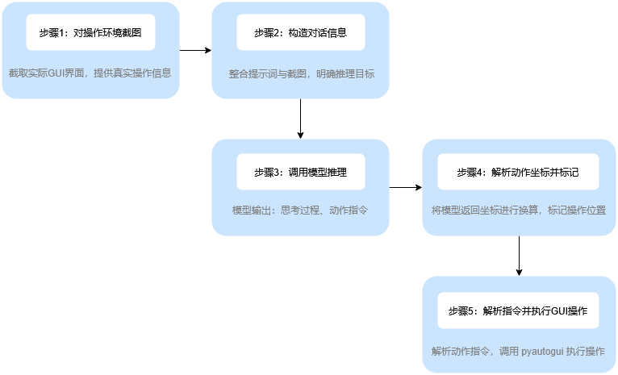

## 图片理解

通过图片 URL 方式传入模型快速体验图片理解效果，Responses API 示例代码如下。

```bash
curl https://ark.cn-beijing.volces.com/api/v3/responses \
-H "Authorization: Bearer $ARK_API_KEY" \
-H 'Content-Type: application/json' \
-d '{
    "model": "doubao-seed-2-0-lite-260215",
    "input": [
        {
            "role": "user",
            "content": [
                {
                    "type": "input_image",
                    "image_url": "https://ark-project.tos-cn-beijing.volces.com/doc_image/ark_demo_img_1.png"
                },
                {
                    "type": "input_text",
                    "text": "支持输入图片的模型系列是哪个？"
                }
            ]
        }
    ]
}'

```

文件路径上传（推荐）
建议优先采用文件路径方式上传本地文件，该方式可以支持最大 512MB 文件的处理。（当前 Responses API 支持该方式）
直接向模型传入本地文件路径，会自动调用 Files API 完成文件上传，再调用 Responses API 进行图片分析。仅 Python SDK 和 Go SDK 支持该方式。具体示例如下：

```python
import asyncio
import os
from volcenginesdkarkruntime import AsyncArk

client = AsyncArk(
    base_url='https://ark.cn-beijing.volces.com/api/v3',
    api_key=os.getenv('ARK_API_KEY')
)
async def main():
    local_path = "/Users/doc/ark_demo_img_1.png"
    response = await client.responses.create(
        model="doubao-seed-2-0-lite-260215",
        input=[
            {"role": "user", "content": [
                {
                    "type": "input_image",
                    "image_url": f"file://{local_path}"  
                },
                {
                    "type": "input_text",
                    "text": "Which model series supports image input?"
                }
            ]},
        ]
    )
    print(response)
if __name__ == "__main__":
    asyncio.run(main())
```


Base64 编码传入
将本地文件转换为 Base64 编码字符串，然后提交给大模型。该方式适用于图片文件体积较小的情况，单张图片小于 10 MB，请求体不能超过 64MB。（Responses API 和 Chat API 都支持该方式。）


Chat API
```python
...
model="doubao-seed-2-0-lite-260215",
messages=[
    {
        "role": "user",
        "content": [
            {
                "type": "image_url",
                "image_url": {
                    "url": f"data:image/png;base64,{base64_image}"
                }
            },
            {
                "type": "text",
                "text": "Which model series supports image input?"
            }
        ]
    }
]
...
```


Responses API
```python
...
model="doubao-seed-2-0-lite-260215",
input=[
    {
        "role": "user",
        "content": [
            {
                "type": "input_image",
                "image_url": f"data:image/png;base64,{base64_image}"
            },
            {
                "type": "input_text",
                "text": "Which model series supports image input?"
            }
        ]
    }
]
...

```


## GUI 任务处理流程

单轮 GUI 任务处理流程如下：


参考docs\GUI-Demo\ 下的示例


## doubao-1-5-vision-pro模型

```bash
curl https://ark.cn-beijing.volces.com/api/v3/chat/completions \
  -H "Content-Type: application/json" \
  -H "Authorization: Bearer $ARK_API_KEY" \
  -d $'{
    "model": "doubao-1-5-vision-pro-32k-250115",
    "messages": [
        {
            "content": [
                {
                    "image_url": {
                        "url": "https://ark-project.tos-cn-beijing.ivolces.com/images/view.jpeg"
                    },
                    "type": "image_url"
                },
                {
                    "text": "图片主要讲了什么?",
                    "type": "text"
                }
            ],
            "role": "user"
        }
    ]
}'
```


```python

import os
from volcenginesdkarkruntime import Ark

# 请确保您已将 API Key 存储在环境变量 ARK_API_KEY 中
# 初始化Ark客户端，从环境变量中读取您的API Key
client = Ark(
    # 此为默认路径，您可根据业务所在地域进行配置
    base_url="https://ark.cn-beijing.volces.com/api/v3",
    # 从环境变量中获取您的 API Key。此为默认方式，您可根据需要进行修改
    api_key=os.environ.get("ARK_API_KEY"),
)

response = client.chat.completions.create(
    # 指定您创建的方舟推理接入点 ID，此处已帮您修改为您的推理接入点 ID
    model="doubao-1-5-vision-pro-32k-250115",
    messages=[
        {
            "role": "user",
            "content": [
                {
                    "type": "image_url",
                    "image_url": {
                        "url": "https://ark-project.tos-cn-beijing.ivolces.com/images/view.jpeg"
                    },
                },
                {"type": "text", "text": "这是哪里？"},
            ],
        }
    ],
    
)

print(response.choices[0])
```
